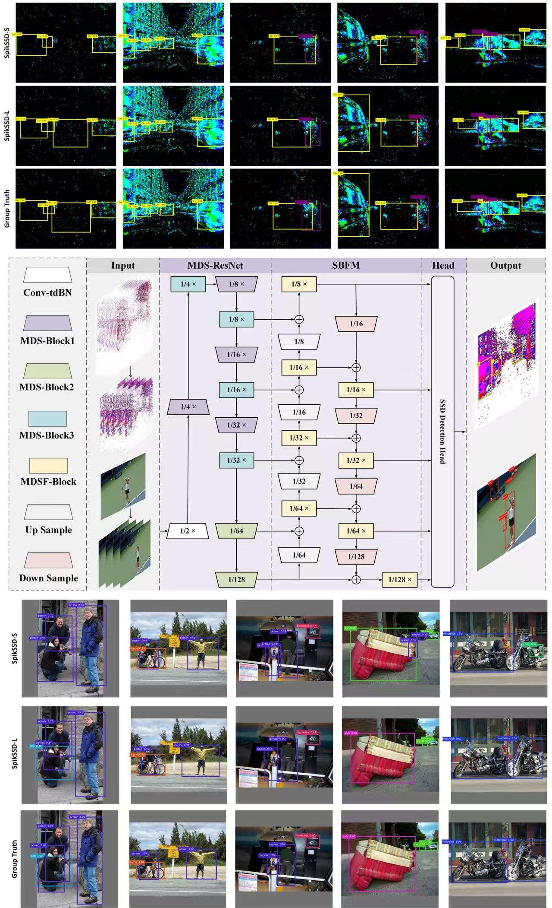

#                           SpikSSD: Better Extraction and Fusion for Object Detection with Spiking Neuron Networks




This is the official implementation of the 'SpikSSD: Better Extraction and Fusion for Object Detection with Spiking Neuron Networks' .

## Required Data

To evaluate or train SpikSSD you will need to download the datasets:

|    Dataset Name    |                             Link                             |
| :----------------: | :----------------------------------------------------------: |
| PASCAL VOC Dataset | [Download PASCAL VOC Detection Dataset](http://host.robots.ox.ac.uk/pascal/VOC/) |
| COCO Dataset | [Download COCO Detection Dataset](https://cocodataset.org/#download) |
| GEN1 Dataset | [Download Gen1 Automotive Detection Dataset](https://www.prophesee.ai/2020/01/24/prophesee-gen1-automotive-detection-dataset/) |

## Training

### Training for SpikSSD

#### SpikSSD-S

python object_detection.py -num_workers 4 -test -save_ckpt -backbone mdsresnet-18 -b 32 -augmentation -fusion -decode spiking

#### SpikSSD-L

python object_detection.py -num_workers 4 -test -save_ckpt -backbone mdsresnet-34 -b 32 -augmentation -fusion -decode spiking

## Evaluation

During evaluation, it is necessary to substitute the relevant pretrained model data into the appropriate root directory.

### Evaluation for SpikSSD

#### SpikSSD-S

python object_detection.py -num_workers 4 -test -save_ckpt -backbone mdsresnet-18 -b 32 -augmentation -fusion -decode spiking -pretrained path_to_model -no_train

#### SpikSSD-L

python object_detection.py -num_workers 4 -test -save_ckpt -backbone mdsresnet-34 -b 32 -augmentation -fusion -decode spiking -pretrained path_to_model -no_train

### Code Acknowledgments

This code is based on [SFOD: Spiking Fusion Object Detector](https://github.com/yimeng-fan/SFOD) . Thanks to the contributors of [SFOD: Spiking Fusion Object Detector](https://github.com/yimeng-fan/SFOD) .

```
@inproceedings{fan2024sfod,
  title={SFOD: Spiking Fusion Object Detector},
  author={Fan, Yimeng and Zhang, Wei and Liu, Changsong and Li, Mingyang and Lu, Wenrui},
  booktitle={Proceedings of the IEEE/CVF Conference on Computer Vision and Pattern Recognition},
  pages={17191--17200},
  year={2024}
}
```

